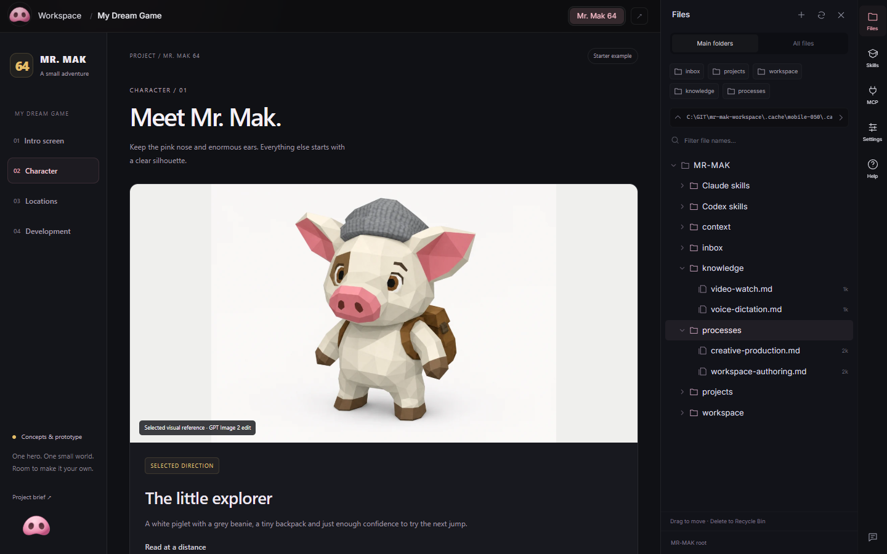

# Mr. Mak Workspace

Your CLI agents, a visual Workspace, and access from your phone.

Mr. Mak has **two connected desktop windows**:

- **Chats** is where you give tasks to Codex, Claude Code or OpenCode. Each
  conversation runs in a real CLI terminal, with its own tab and saved history.
- **Workspace** is where you review the results: project pages, research, images,
  saved prompts and reports. Files, skills, MCP connections and settings sit
  alongside your work.

Keep the windows side by side, or minimize either one independently. You can
leave Chats in view while working in Blender, a game engine or your browser.

**New in 0.5: [connect your phone](#on-your-phone)** to follow the same chats,
send ideas and dictate messages while the agents keep working on your computer.


*Chats on the left, Workspace on the right. App views arranged side by side
with sample conversations and the included My Dream Game project.*

## On your phone

Read replies, send follow-ups or images, and open Workspace reports from a mobile
web app you can add to your Home Screen. The phone connects to Mr. Mak on your
computer through **Tailscale**. Your agents keep running on the computer with
their existing CLI accounts.

<a href="docs/assets/mobile-overview.png"></a>

*Your chats, a conversation, and voice input in one overview. Tap the image
to see it at full size. Sample conversations shown.*

- **Pair from Chats.** Press the phone button on your computer, enable mobile
  access, scan the QR code and confirm the matching code on the desktop.
- **Pick up where you left off.** Pair once, then reopen the same phone shortcut.
  Phone and desktop can show different chats while sharing the conversation.
- **Speak a draft.** Tap the microphone, record your message and stop to
  transcribe it. Review the text before pressing Send.

Keep the computer awake with Mr. Mak running, and Tailscale connected on both
devices. The microphone button uses separately billed OpenRouter or OpenAI API
credit; its key stays on your computer. Typing and your phone keyboard's own
dictation need no Mr. Mak transcription key.

[Set up mobile access and voice input](docs/mobile-access.md)

## Everyday tools

- **Your files, close at hand.** Browse a folder tree with Main folders or All
  files, jump to `inbox`, `projects`, `workspace`, `knowledge` and `processes`,
  and open any folder in Windows Explorer.
- **Readable notes you can edit.** Open Markdown as a formatted document, switch
  to Edit, and save changes in the same window. Preview images, video and audio
  alongside the file tree.
- **Choose a reading theme.** Settings > Appearance offers Dark, Light and
  System. Light uses dark text on white across Workspace and standard reports.
  Images keep their original colors; terminal appearance is set separately.
- **Chats you can return to.** Pin conversations in history, reorder and color
  tabs, and see which agents are working or have a reply you have not viewed.
  Drop files or folders into a chat to insert their paths; clipboard images are
  saved in `inbox/attachments`.
- **Projects with their work attached.** Keep research, design versions, saved
  prompts and motion tests in tabs inside a card. Open images at full size and
  download them from the preview. In the desktop app, click a card's status dot
  to change its status or category, pin it, or archive it. Restore archived cards
  from search or Show archive; their files and tabs stay in place.
- **Skills and tools within reach.** The right rail opens project skills,
  knowledge, workflows, MCP connections, Settings and Help. See which MCP
  connections come from the project and which come from your agent's global setup.



## Before you start

**Prerequisite: install and configure Codex CLI, Claude Code CLI or OpenCode
before setting up Mr. Mak.** You need at least one. They can run side by side
and are separate installations, not bundled with Mr. Mak.

- [Install Codex CLI](https://developers.openai.com/codex/cli)
- [Install Claude Code CLI](https://code.claude.com/docs/en/setup)
- [Install OpenCode](https://opencode.ai/docs/)

**Do I need an API key?** No, not for Claude Code or Codex chats when you sign
in with an eligible subscription. Mr. Mak runs the real CLI with its existing
login: Claude Pro/Max can use Claude Code, and Codex can use ChatGPT subscription
access. Normal plan limits still apply. API billing is an alternative, not a
requirement. See [Claude authentication](https://code.claude.com/docs/en/authentication)
and [Codex authentication](https://developers.openai.com/codex/auth).

**OpenCode** uses the providers and authentication you configure in OpenCode.
Their access and billing rules still apply; support here does not turn a Claude
Code subscription into OpenCode API access. Choose **+ > OpenCode** in Chats.

The optional voice coordinator specifically requires **Codex CLI** and your own
**OpenAI API key**. Voice API usage is billed separately. Leave voice off to use
subscription-backed CLI chats without an API key.

## Start with an agent

Use **Use this template** on GitHub to create your own repository, then clone it
into a folder you control. Open that folder in your installed Codex CLI,
Claude Code CLI or OpenCode and paste:

> Set up this Mr. Mak Workspace repository on my computer. Read AGENTS.md and
> docs/getting-started.md, check the prerequisites, and help me run the Windows
> desktop app. Use my own CLI accounts. Leave optional voice, paid providers,
> MCP connections and the Win-key shortcut off until I choose to connect them.
> Keep my credentials in the ignored .env file. Show me the four examples and
> help me replace them with my own project.

The repository includes examples, instructions and application source. You bring
your own agent accounts and any services you want to use.

## Run the desktop app

On Windows, download the installer from [Releases](https://github.com/witnesstodark/mr-mak-workspace/releases/latest),
install **Mr. Mak Workspace**, then open **Start Mr. Mak.cmd** in your cloned
repository. On Linux, build the Tauri desktop target after installing the Node,
Rust and WebKitGTK prerequisites, then launch the resulting AppImage/deb install
with `--repo /path/to/your/workspace`. On both systems, use **+** in Chats to
open an installed CLI and sign in with your own account.

The installer includes the local Node service. It does not include Codex,
Claude Code, OpenCode, Kimi, Blender, Python or provider accounts.

**Already using Mr. Mak?** Read the [0.5.0 update notes](CHANGELOG.md) for
mobile chat access, voice dictation and the Linux AppImage packaging fix.
Follow the
[update guide](docs/updating.md) to update the app and add skills to your existing
repository without replacing your projects.

To build from source, install Node.js 22.20+ and the Windows Tauri build
prerequisites, then run:

```powershell
powershell -ExecutionPolicy Bypass -File .\Setup.ps1 -Mode Check
powershell -ExecutionPolicy Bypass -File .\Setup.ps1 -Mode Desktop
```

For a browser preview of the reports, use `-Mode Preview` with Node.js 22.20+
and npm. Rust and C++ Build Tools are needed only to compile the native desktop
app; they are not required for Preview or the downloaded installer. The native
desktop app adds managed terminals, local file operations and voice.
See [getting started](docs/getting-started.md) for the complete setup and
[architecture](desktop/README.md) for the source layout.

## What is inside

| Example | What it demonstrates |
| --- | --- |
| **My Dream Game** | Mr. Mak 64: an illustrated game hub with an intro screen, character studies, locations and a development board. |
| **Creative MCP Connections** | A researched connection shortlist, source links and a practical setup checklist. |
| **Make Workspace Yours** | Getting started, everyday use and changes you can ask an agent to make. |
| **Arachne Character Lab** | Versions 1 through 9, expandable saved prompts, 158 images and eight motion studies. |

The examples stay visible until you archive them. Create your own cards next to
them, or archive all four when you are ready.


Terminal text settings let you adjust readability. In agent chats, Ctrl+C copies
selected text; PowerShell keeps normal shell behavior.
Click web links in chats or cards to open your default browser. New Codex and
Claude chats start with `xhigh` effort; saved effort choices are preserved.
OpenCode keeps its own model and reasoning configuration.

## Optional asset delivery evidence

Asset deliveries can carry a local SHA-256 manifest. The offline
[asset delivery tool](scripts/asset-delivery/README.md) records inputs and outputs
for a card without changing existing cards. Verification checks file integrity;
visual approval and engine readiness remain separate decisions.

## Skills you can keep

Twenty project skills cover planning, handoffs, Workspace reports, image
references, fal.ai generation, Higgsfield workflows, character sheets, procedural
Three.js modeling, materials, motion references, Blender game animation, video
inspection and dictation setup. Game workflows cover **VFX, UI, animation
integration, level design, audio and native visual review**. Read the
[skill index](docs/skills.md), or take the separate skills ZIP from the release
into another project.

The maintained instructions live in `.agents/skills`. Complete copies in
`.claude/skills` include the same instructions and resources. Both agents get the
full skills. Run `npm run skills:sync` after editing the maintained source.
Copy a skill together with its referenced resources; keep `.env`, job receipts
and account configuration private.

## Optional voice and connections

You can work entirely through the CLI chats. The floating nose adds an optional
voice assistant: OpenAI Live supplies the voice connection over API, and the
coordinator uses your signed-in Codex CLI. Voice API usage is billed separately
from a CLI subscription. The coordinator uses your Codex model configuration
unless you set `MRMAK_COORDINATOR_MODEL` in `.env`.

fal.ai, Higgsfield and other providers are optional and use your own accounts.
MCP configuration starts empty. The MCP panel explains where connections are
configured, including any global connections your existing agents already have.
The research sample is a shortlist, not a claim that those tools are installed.

## Make it yours

Edit the placeholder files in `context/`, keep reusable lessons in `knowledge/`,
and save workflows in `processes/`. English is the default for stored content;
ask for another language whenever you need it. The app's Win-key shortcut and
permission bypass both start disabled.

This release targets **Windows x64 and Linux**. Browser report previews can run
elsewhere; macOS native packaging remains future work. See [customization](docs/customization.md) and
[sharing your version](docs/sharing.md).

Application code and original workflow documentation are under the MIT license.
Bundled third-party skill materials keep their original licenses. Sample media
is supplied for learning and remixing; see [third-party notices](THIRD_PARTY_NOTICES.md).

---

Mr. Mak is small.


